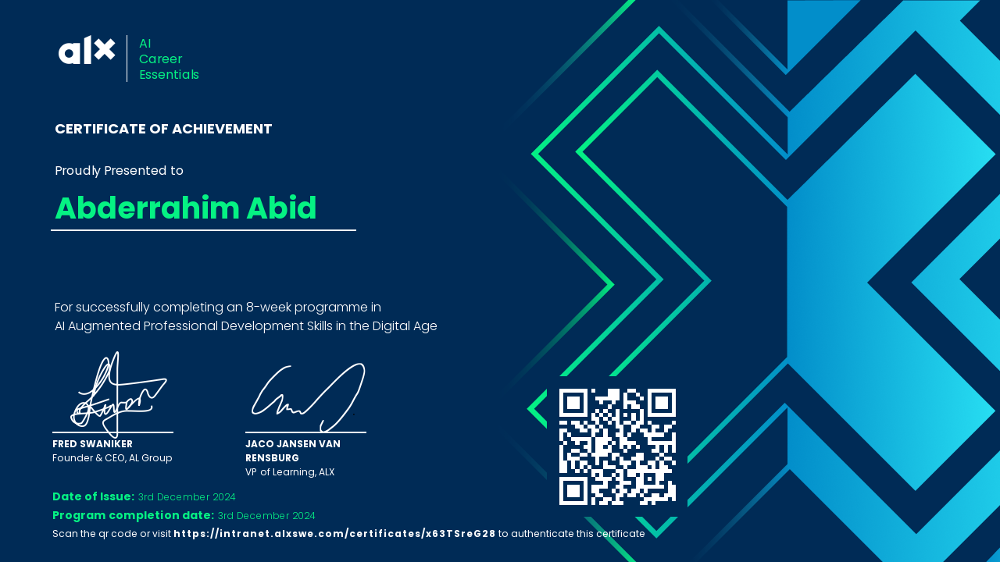

# AI Career Essentials Certificate

Hi there! 👋  
Welcome to the repository showcasing my **AI Career Essentials Certificate**, awarded by **Microsoft** and **LinkedIn Learning**.

---

## 🌟 About the Certificate  
The **AI Career Essentials Certificate** is a testament to my foundational understanding of Artificial Intelligence, its applications, and its role in shaping future careers.  
This certification covers key concepts such as:
- Basics of Artificial Intelligence (AI)
- AI ethics and its societal impact
- Practical AI applications in various industries
- Building AI solutions and career pathways in AI

It demonstrates my commitment to continuous learning in the rapidly growing AI field. 🚀

---

## 🏆 Certificate Preview  
Here’s a preview of the certificate:  

---

Thank you for visiting this repository! Feel free to leave a ⭐ if you find it interesting.
